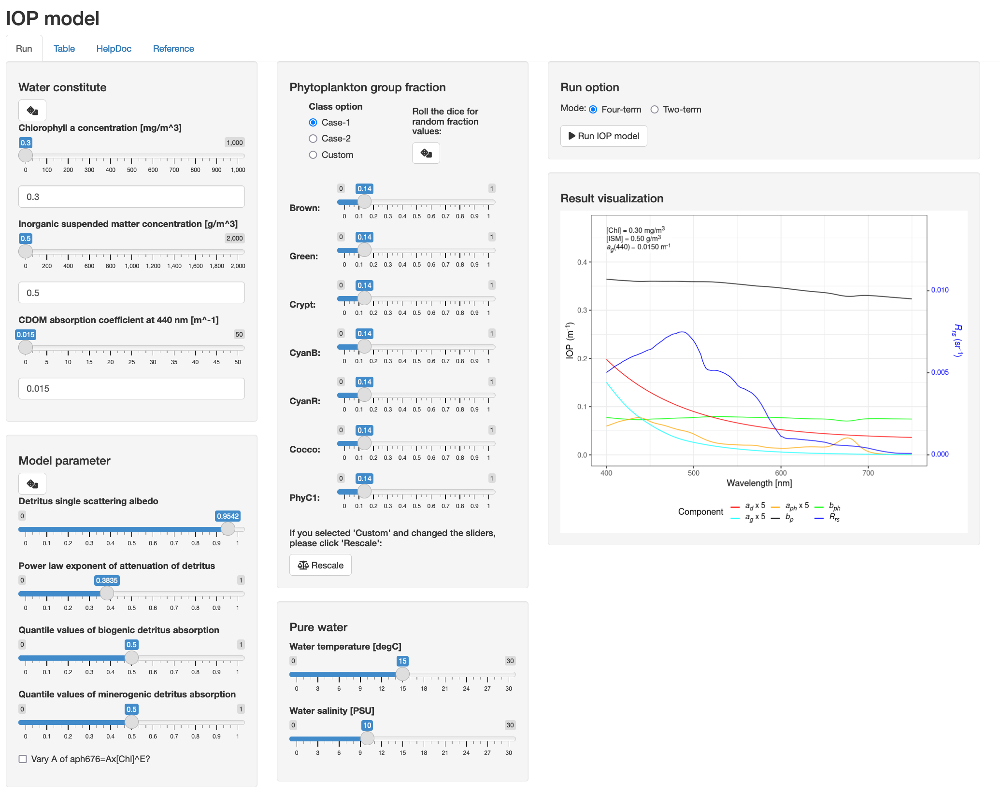

<!-- README.md is generated from README.Rmd. Please edit that file -->

```{r, include = FALSE}
knitr::opts_chunk$set(
  collapse = TRUE,
  comment = "#>",
  fig.path = "man/figures/README-",
  out.width = "100%"
)
```

# IOPmodel

<!-- badges: start -->

[](https://lifecycle.r-lib.org/articles/stages.html#experimental)

<!-- badges: end -->

The goal of `IOPmodel` is to compute inherent optical properties (IOPs) from component concentrations, i.e., Chlorophyll *a* concentration, suspended matter concentration, and CDOM absorption.

## Webtool

Try our webtool to run this model: <https://bishun945.shinyapps.io/IOPmodel/>



## Installation

You can install the development version of `IOPmodel` like so:

``` r
remotes::install_github("bishun945/IOPmodel")
```

## Example

This is a basic example which shows you how to use `IOPmodel` to generate IOPs and Remote-sensing reflectance (Rrs):

```{r example, echo=FALSE, fig.height=9, fig.width=9, warning=FALSE}
library(IOPmodel)
library(data.table)
library(ggplot2)
library(magrittr)

gen_case <- function(Chl, ISM, ag440) {
  
  res_IOP <- IOP_four_comp(Chl = Chl, ag440 = ag440, ISM = ISM)
  result <- 
    as.data.table(res_IOP$spec) %>%
    dplyr::mutate(Rrs = Rrs_L11, Chl = Chl, ag440 = ag440, ISM = ISM)
      
  result
  
}

show_spec <- function(tmp) {

  tmp <- tmp[between(wavelen,  400, 750)]
  
  Rrs_scale <- max(c(tmp$bp, tmp$aph * 5, tmp$ad * 5, 
                     tmp$acdom * 5)) * 0.7 / max(c(tmp$Rrs))

  dt_label <- data.table(
    x = 650,
    y = max(c(tmp$bp, tmp$aph * 5, tmp$ad * 5, tmp$acdom * 5)) * 1.3,
    label = sprintf(paste0(c("[Chl] = %.2f mg/m<sup>3</sup><br>",
                             "[ISM] = %.2f g/m<sup>3</sup><br>",
                             "*a*<sub>*g*</sub>(440) = %.4f m<sup>-1</sup>"),
                           collapse = ""),
                    tmp$Chl[1], tmp$ISM[1], tmp$ag440[1])
  )

  y_title_left <- "IOP (m<sup>-1</sup>)"
  y_title_right <- "*R*<sub>*rs*</sub> (sr<sup>-1</sup>)"

  tmp %>%
    ggplot(aes(x = wavelen)) +
    geom_path(aes(y = bp, col = "bp")) +
    geom_path(aes(y = bph, col = "bph")) +
    geom_path(aes(y = aph * 5, col = "aph")) +
    geom_path(aes(y = ad * 5, col = "ad")) +
    geom_path(aes(y = acdom * 5, col = "ag")) +
    geom_path(aes(y = Rrs * Rrs_scale, col = "Rrs")) +
    ggtext::geom_richtext(inherit.aes = FALSE, data = dt_label,
                          aes(x = 400, y = y, label = label),
                          hjust = 0, vjust = 1, family = "Times",
                          label.padding = unit(rep(0, 4), "lines"),
                          label.color = NA,
                          fill = alpha("white", 0.7)) +
    scale_x_continuous(name =  "Wavelength [nm]", 
                       limits = c(400, 750), 
                       breaks = seq(300, 900, 100)) +
    scale_y_continuous(name = y_title_left,
                       sec.axis =
                         sec_axis(~./Rrs_scale,
                                  name = y_title_right)) +
    scale_color_manual(
      "Component",
      values = c(
        "aph" = "orange",
        "ad" = "red",
        "ag" = "cyan",
        "bp" = "black",
        "bph" = "green",
        "Rrs" = "blue"
        ),
      labels = c(
        "aph" = "*a*<sub>*ph*</sub> x 5",
        "ad" = "*a*<sub>*d*</sub> x 5",
        "ag" = "*a*<sub>*g*</sub> x 5",
        "bp" = "*b*<sub>*p*</sub>",
        "bph" = "*b*<sub>*ph*</sub>",
        "Rrs" = "*R*<sub>*rs*</sub>"
        )
    ) +
    theme_bw(base_size = 14, base_family = "Times") +
    theme(
      axis.title.y.left = ggtext::element_markdown(),
      axis.title.y.right = ggtext::element_markdown(color = "blue"),
      axis.text.y.right = ggtext::element_markdown(color = "blue"),
      legend.text = ggtext::element_markdown(size = 12),
      legend.title = ggtext::element_markdown(),
      legend.position = "bottom"
    )

}

set.seed(123)

patchwork::wrap_plots(
  show_spec(gen_case(Chl = 0.14,   ISM = 0.01, ag440 = 0.0115)),
  show_spec(gen_case(Chl = 9.36,   ISM = 0.10, ag440 = 0.0303)),
  show_spec(gen_case(Chl = 105.26, ISM = 0.16, ag440 = 0.2566)),
  show_spec(gen_case(Chl = 30.11,  ISM = 20.0, ag440 = 0.5231)),
  guides = "collect"
) &
  theme(
    axis.title.y.left = ggtext::element_markdown(),
    axis.title.y.right = ggtext::element_markdown(color = "blue"),
    axis.text.y.right = ggtext::element_markdown(color = "blue"),
    legend.text = ggtext::element_markdown(size = 14),
    legend.title = ggtext::element_markdown(),
    legend.position = "bottom",
    legend.margin = margin(),
    plot.title = element_text(hjust = 0, margin = margin())
  )
```

The code for the above figures.

```{r eval=FALSE, include=TRUE}
library(IOPmodel)
library(data.table)
library(ggplot2)
library(magrittr)

gen_case <- function(Chl, ISM, ag440) {
  
  res_IOP <- IOP_four_comp(Chl = Chl, ag440 = ag440, ISM = ISM)
  result <- 
    as.data.table(res_IOP$spec) %>%
    dplyr::mutate(Rrs = Rrs_L11, Chl = Chl, ag440 = ag440, ISM = ISM)
      
  result
  
}

show_spec <- function(tmp) {

  tmp <- tmp[between(wavelen,  400, 750)]
  
  Rrs_scale <- max(c(tmp$bp, tmp$aph * 5, tmp$ad * 5, 
                     tmp$acdom * 5)) * 0.7 / max(c(tmp$Rrs))

  dt_label <- data.table(
    x = 650,
    y = max(c(tmp$bp, tmp$aph * 5, tmp$ad * 5, tmp$acdom * 5)) * 1.3,
    label = sprintf(paste0(c("[Chl] = %.2f mg/m<sup>3</sup><br>",
                             "[ISM] = %.2f g/m<sup>3</sup><br>",
                             "*a*<sub>*g*</sub>(440) = %.4f m<sup>-1</sup>"),
                           collapse = ""),
                    tmp$Chl[1], tmp$ISM[1], tmp$ag440[1])
  )

  y_title_left <- "IOP (m<sup>-1</sup>)"
  y_title_right <- "*R*<sub>*rs*</sub> (sr<sup>-1</sup>)"

  tmp %>%
    ggplot(aes(x = wavelen)) +
    geom_path(aes(y = bp, col = "bp")) +
    geom_path(aes(y = bph, col = "bph")) +
    geom_path(aes(y = aph * 5, col = "aph")) +
    geom_path(aes(y = ad * 5, col = "ad")) +
    geom_path(aes(y = acdom * 5, col = "ag")) +
    geom_path(aes(y = Rrs * Rrs_scale, col = "Rrs")) +
    ggtext::geom_richtext(inherit.aes = FALSE, data = dt_label,
                          aes(x = 400, y = y, label = label),
                          hjust = 0, vjust = 1, family = "Times",
                          label.padding = unit(rep(0, 4), "lines"),
                          label.color = NA,
                          fill = alpha("white", 0.7)) +
    scale_x_continuous(name =  "Wavelength [nm]", 
                       limits = c(400, 750), 
                       breaks = seq(300, 900, 100)) +
    scale_y_continuous(name = y_title_left,
                       sec.axis =
                         sec_axis(~./Rrs_scale,
                                  name = y_title_right)) +
    scale_color_manual(
      "Component",
      values = c(
        "aph" = "orange",
        "ad" = "red",
        "ag" = "cyan",
        "bp" = "black",
        "bph" = "green",
        "Rrs" = "blue"
        ),
      labels = c(
        "aph" = "*a*<sub>*ph*</sub> x 5",
        "ad" = "*a*<sub>*d*</sub> x 5",
        "ag" = "*a*<sub>*g*</sub> x 5",
        "bp" = "*b*<sub>*p*</sub>",
        "bph" = "*b*<sub>*ph*</sub>",
        "Rrs" = "*R*<sub>*rs*</sub>"
        )
    ) +
    theme_bw(base_size = 14, base_family = "Times") +
    theme(
      axis.title.y.left = ggtext::element_markdown(),
      axis.title.y.right = ggtext::element_markdown(color = "blue"),
      axis.text.y.right = ggtext::element_markdown(color = "blue"),
      legend.text = ggtext::element_markdown(size = 12),
      legend.title = ggtext::element_markdown(),
      legend.position = "bottom"
    )

}

set.seed(123)

patchwork::wrap_plots(
  show_spec(gen_case(Chl = 0.14,   ISM = 0.01, ag440 = 0.0115)),
  show_spec(gen_case(Chl = 9.36,   ISM = 0.10, ag440 = 0.0303)),
  show_spec(gen_case(Chl = 105.26, ISM = 0.16, ag440 = 0.2566)),
  show_spec(gen_case(Chl = 30.11,  ISM = 20.0, ag440 = 0.5231)),
  guides = "collect"
) &
  theme(
    axis.title.y.left = ggtext::element_markdown(),
    axis.title.y.right = ggtext::element_markdown(color = "blue"),
    axis.text.y.right = ggtext::element_markdown(color = "blue"),
    legend.text = ggtext::element_markdown(size = 14),
    legend.title = ggtext::element_markdown(),
    legend.position = "bottom",
    legend.margin = margin(),
    plot.title = element_text(hjust = 0, margin = margin())
  )
```

## References

-   Shun Bi, Martin Hieronymi, Rüdiger Röttgers, Bio-geo-optical modeling of natural waters, Frontiers in Marine Science. 2023.

-   Loisel, Hubert, Daniel Schaffer Ferreira Jorge, Rick A. Reynolds, and Dariusz Stramski. “A Synthetic Database Generated by Radiative Transfer Simulations in Support of Studies in Ocean Optics and Optical Remote Sensing of the Global Ocean.” Preprint. ESSD – Ocean/Physical oceanography, March 9, 2023. <https://doi.org/10.5194/essd-2023-80>.

-   Ramírez-Pérez, M., M. Twardowski, C. Trees, J. Piera, and D. McKee. “Inversion of In Situ Light Absorption and Attenuation Measurements to Estimate Constituent Concentrations in Optically Complex Shelf Seas.” Journal of Geophysical Research: Oceans 123, no. 1 (January 2018): 720–37. <https://doi.org/10.1002/2017JC013453>.
